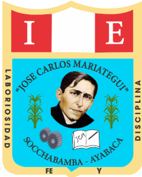

<p align="center">
  
</p>

<h1 align="center">I.E. José Carlos Mariátegui</h1>

<p align="center">
  Sitio web institucional de la comunidad educativa de Socchabamba - Ayabaca
</p>

<p align="center">
  <strong>Formando el futuro con educación de calidad</strong>
</p>

## Sobre el sitio

Este proyecto reúne la presencia digital de la Institución Educativa José Carlos Mariátegui, institución pública de nivel secundaria ubicada en la comunidad de Socchabamba, distrito y provincia de Ayabaca, región Piura, Perú.

El sitio acerca a estudiantes, familias, docentes y visitantes a la vida institucional, los principios educativos y los recursos de aprendizaje de la comunidad mariateguista.

## Qué encontrarás

- **Inicio institucional:** presentación de la institución, su ubicación y su propuesta educativa.
- **Institución:** identidad, misión, visión y valores que orientan el trabajo de la comunidad educativa.
- **Actividades:** noticias, eventos, celebraciones, concursos, jornadas deportivas y galerías fotográficas.
- **Matrícula, comunicados y contacto:** información de interés para las familias y la comunidad.
- **Aula de aprendizaje:** acceso a módulos interactivos de Matemática y Comunicación.
- **Revista Mariateguista:** publicación institucional disponible para lectura y consulta.

## Identidad institucional

La institución atiende a estudiantes de nivel secundaria de la comunidad de Socchabamba. Su propuesta promueve una educación integral, inclusiva y vinculada con la cultura andina, el trabajo comunitario, la valoración del agua y el compromiso con el desarrollo de las comunidades.

### Misión

Lograr que las y los estudiantes culminen satisfactoriamente sus estudios secundarios y desarrollen los aprendizajes establecidos en el perfil de egreso, en escenarios inclusivos, democráticos, seguros y libres de violencia.

### Visión

Formar estudiantes con mayor nivel educativo, identidad cultural, dominio de competencias, capacidad para resolver problemas, disposición para seguir aprendiendo y compromiso social con sus comunidades y el país.

### Valores

- Laboriosidad
- Respeto
- Disciplina
- Fe y perseverancia

## Aula de aprendizaje

La sección [Aula de aprendizaje](aprendizaje/index.html) integra dos módulos de refuerzo:

- [Reforzando Operaciones Básicas](aprendizaje/aritmetica/index.html): práctica progresiva de suma, resta, multiplicación y división.
- [YACHAY, laboratorio de palabras](aprendizaje/yachay/index.html): desafíos de analogías y razonamiento verbal.

Los módulos funcionan dentro del mismo sitio institucional y conservan su propia experiencia de aprendizaje y almacenamiento local de resultados.

## Revista Mariateguista

La carpeta [`revista/`](revista/) contiene la primera edición de la Revista Mariateguista, junto con su portada institucional.

## Tecnologías

- HTML5 para la estructura y el contenido.
- CSS3 para el diseño adaptable y la identidad visual.
- JavaScript para la navegación, el carrusel, las galerías y las interacciones.
- Imágenes en formatos JPG, WEBP, PNG y SVG para las galerías y los recursos educativos.

El sitio principal no requiere un proceso de compilación ni dependencias externas para ejecutarse.

## Estructura del proyecto

```text
.
├── index.html                # Página principal institucional
├── css/                      # Hojas de estilo del sitio principal
├── js/                       # Interacciones y lógica de la web
├── img/                      # Logotipo, fotografías y recursos visuales
├── aprendizaje/              # Aula de aprendizaje y sus módulos
├── revista/                  # Revista Mariateguista
└── docs/                     # Documentos de identidad institucional
```

## Ejecución local

Puede abrirse `index.html` directamente en un navegador. Para simular un servidor web local, ejecute desde la raíz del repositorio:

```bash
python -m http.server 8000
```

Luego visite [http://localhost:8000](http://localhost:8000).

## Propósito

Este repositorio busca mantener una plataforma clara, cercana y representativa de la I.E. José Carlos Mariátegui: un espacio para comunicar la vida escolar, fortalecer el vínculo con las familias y ofrecer recursos que acompañen el aprendizaje de sus estudiantes.
